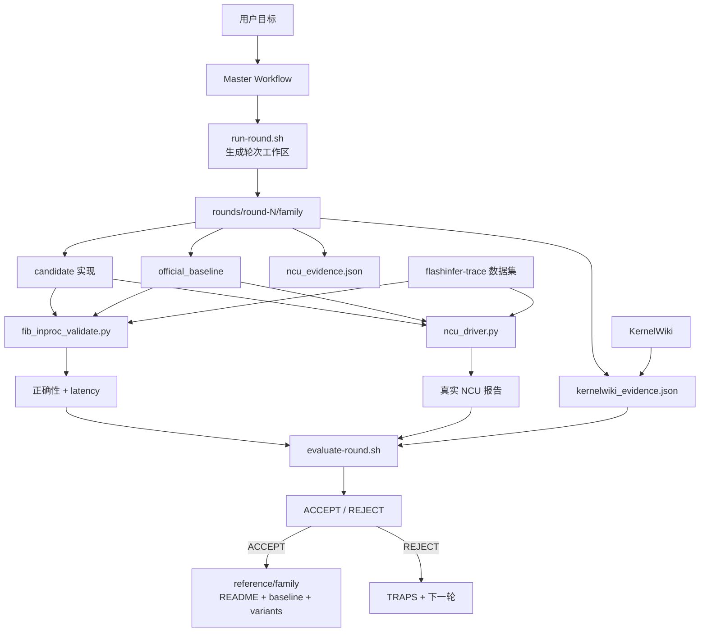

# KernelForge-MultiAgent

KernelForge-MultiAgent 是一个面向 FlashInfer 类算子的闭环优化工作流仓库。它发布的是提示词、流程脚本、验证入口、规则约束和归档结构，而不是大规模数据集或所有运行产物。

当前仓库只主动优化 3 类主线算子：

- `dsa_sparse_attention`
- `gdn_prefill`
- `dsa_topk_indexer`

工作流依赖以下本地能力：

- `Humanize`
- `skills/KernelWiki`
- `skills/ncu-report-skill`
- `flashinfer-bench`

## 整体架构



## 仓库内容

| 路径 | 作用 |
|---|---|
| `verify.py` | 仓库布局校验入口。 |
| `configs/` | 主线 family 策略与规则配置。 |
| `scripts/` | 轮次生成、评估、数据准备、验证脚本。 |
| `reference/` | 已归档 family 的 baseline、TRAPS、variants。 |
| `rounds/` | 轮次工作区模板与历史工作区。 |
| `prompts/` | 提示词模板。 |
| `skills/` | 本地技能目录，含 `KernelWiki` 与 `ncu-report-skill`。 |
| `docs/` | 规则、复现、支持算子说明。 |
| `kernels/` | 仓库内保留的 CUDA 算子源码目录。 |

## 运行规则

- 只允许在 WSL / Linux 环境执行闭环验证、benchmark 和 NCU。
- 每轮必须基于真实 `safetensors` workload。
- 每轮决策必须同时有真实 benchmark 和真实 NCU 证据。
- NCU 只能使用 `/usr/local/NVIDIA-Nsight-Compute-2025.2/ncu`。
- 正确性必须复用官方 harness 语义，并显式拒绝 `NaN` / `Inf`。
- 新轮次必须从官方 baseline 源码派生，不能把自研候选改名成 baseline。
- 同一时间只跑一个 benchmark / NCU 任务。

## 快速开始

1. 准备依赖与技能

```bash
/plugin marketplace add PolyArch/humanize
/plugin install humanize@PolyArch
```

确认本地可见：

- `skills/KernelWiki`
- `skills/ncu-report-skill`
- `flashinfer-bench`
- `flashinfer-trace`

2. 启动某个主线 family

```bash
cd /mnt/d/agent/KernelForge-MultiAgent
./scripts/start-campaign.sh dsa_sparse_attention 10
```

3. 创建并进入轮次

```bash
./scripts/run-round.sh dsa_sparse_attention 0
```

4. 用真实数据验证候选

```bash
python scripts/workflow/fib_inproc_validate.py \
  --dataset /mnt/d/Agent/flashinfer-trace \
  --definition dsa_sparse_attention_h16_ckv512_kpe64_topk2048_ps64 \
  --solution <candidate_solution> \
  --baseline official_reference_dsa_sparse_attention_v1
```

5. 用真实 NCU 采样

```bash
/usr/local/NVIDIA-Nsight-Compute-2025.2/ncu -f -o profile/<family>/sol \
  --set full python scripts/workflow/ncu_driver.py \
  --dataset /mnt/d/Agent/flashinfer-trace \
  --definition <definition> \
  --solution <candidate_solution> \
  --baseline <official_baseline_solution> \
  --which sol
```

## 当前主线

| Family | 默认 definition | 说明 |
|---|---|---|
| `dsa_sparse_attention` | `dsa_sparse_attention_h16_ckv512_kpe64_topk2048_ps64` | 当前最高优先级主战场。 |
| `gdn_prefill` | `gdn_prefill_qk4_v8_d128_k_last` | 变长 prefill 路径。 |
| `dsa_topk_indexer` | `dsa_topk_indexer_fp8_h64_d128_topk2048_ps64` | 索引与访存敏感路径。 |

非主线算子默认不主动推进，除非用户单独重开。

## 发布边界

这个仓库主要保留：

- workflow 脚本
- prompt
- 规则
- reference 归档
- 最小验证入口

默认不提交：

- 大型数据集
- `.ncu-rep` / `.nsys-rep`
- 日志
- build 产物
- 本地 profile 结果

## 相关文档

- [docs/SUPPORTED_OPERATORS.md](docs/SUPPORTED_OPERATORS.md)
- [docs/OPERATORS_QUICK_REF.md](docs/OPERATORS_QUICK_REF.md)
- [docs/FLASHINFER_BENCH_VALIDATION.md](docs/FLASHINFER_BENCH_VALIDATION.md)
- [docs/reproduction.md](docs/reproduction.md)
